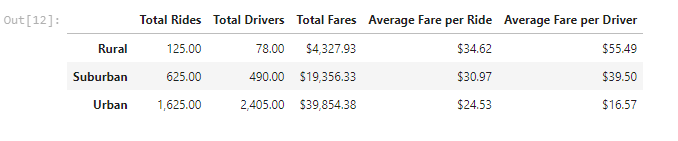
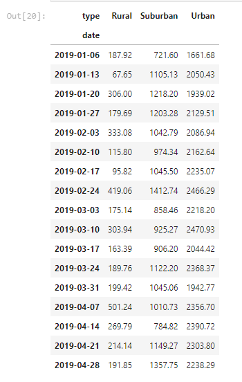
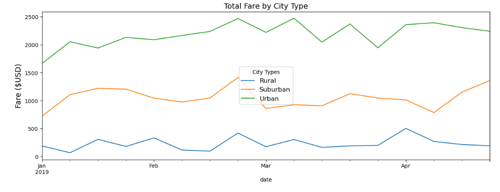

# PyBer Analysis

## Purpose

*The primary goal of this project is to create rideshare data visualizations for PyBer to help improve access to rideshare services and determine affordability for underserved neighborhoods. This was run by comparing rideshare data across city types.* 

## Overview

- Deliverable 1: A ride-sharing summary DataFrame by city type
- Deliverable 2: A multiple-line chart of total fares for each city type
- Deliverable 3: A written report for the PyBer analysis (README.md)

## Results

- PyBer summary DataFrame

### Analysis

Urban cities have the highest number of rides (68.4%). On the contrary, rural cities have the lowest number (5.2%). Likewise, urban cities have the highest number of drivers coompared to rural cities. However, the average fare per ride and per driver is higher in rural cities compared to suburban and urban cities. 

- Sum of the fares for each week

- Multiple-line chart of total fares for each city type.

This multiple-line chart provides information on fare fluctuations by city for the period from January to April 2019. At the end of February all the cities had an increase in fares; however, urban cities had more overall fluctuations in March. Moreover, the highest total rural fare was $500 in April 2019. Lastly, suburban cities had a spike at the end of April compared to urban and rural cities.

***

## Summary

